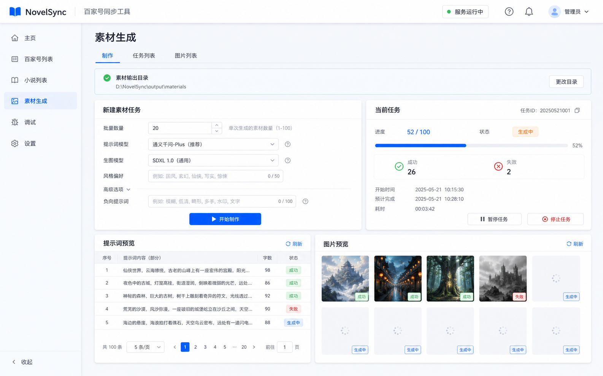
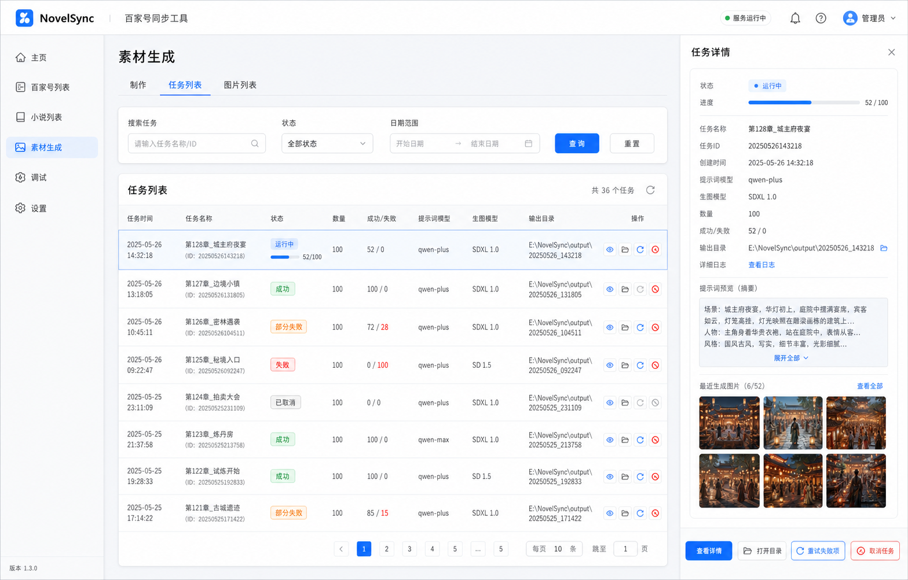
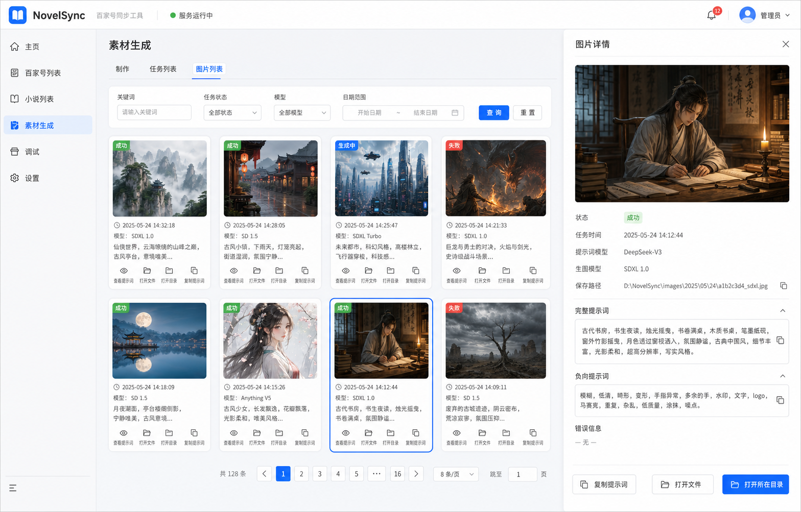
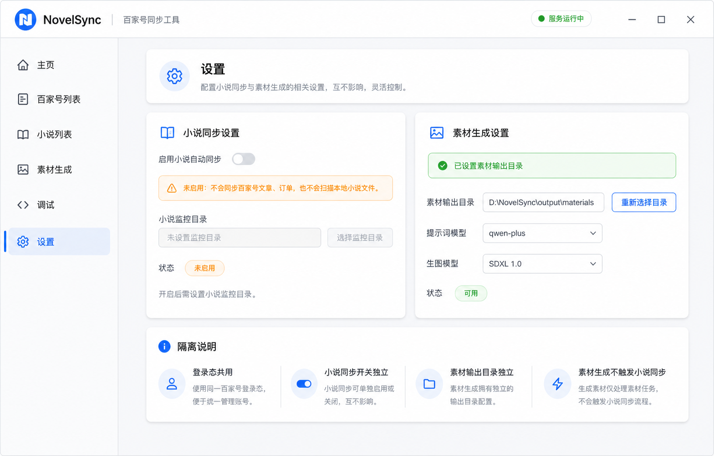

# NovelSync 素材生成模块接入详细设计与开发计划

## 目标

在 NovelSync 中新增一个独立的“素材生成”模块，用于批量生成美女图片素材。模块必须登录后可用，但不能触发或依赖小说同步逻辑。每一次批量制作作为一个任务保存到 SQLite，任务内包含 1-100 张图、每张图的提示词、图片本地路径、生成状态和错误信息。

## 非目标

- 不把素材生成接入百家号、小说列表、订单同步或本地小说文件监控。
- 不让登录行为自动触发小说同步。
- 不改变已有小说同步的数据结构含义和同步流程，只给它增加显式开关门禁。
- 第一版不做历史重复度检测，保留数据结构扩展位。

## 总体结论

素材生成可以接入 NovelSync，但必须以独立业务域接入：

- 共用：桌面壳、登录态、FastAPI sidecar、SQLite、设置页、日志能力。
- 隔离：任务模型、API 路由、前端页面、输出目录、LLM/生图配置、执行队列。
- 保护：小说同步 worker 只有在“小说自动同步”开关开启并满足必要配置时才执行。

## 模块边界

### 共享层

- Tauri 桌面端：继续使用现有 `src-tauri` sidecar 启动方式。
- React/Ant Design 布局：继续使用现有 `src/App.tsx` 登录保护和左侧菜单。
- FastAPI：继续使用 `python-core/api/main.py` 作为应用入口，但新增路由建议拆到独立文件后挂载。
- SQLite：继续使用 `sqlmodel`、`storage/database.py` 的应用数据目录和自动迁移机制。

### 小说同步域

小说同步域只负责：

- 百家号 Cookie 同步。
- 文章同步。
- 订单同步。
- 本地小说文件扫描、匹配和推送。

它新增一个显式开关：`novel_sync_enabled`。

### 素材生成域

素材生成域只负责：

- 生成中文自然语言提示词。
- 调用生图模型。
- 保存图片到“素材输出目录”。
- 保存任务、提示词、图片结果到 SQLite。
- 展示任务列表、图片列表和每张图对应提示词。

它不读取百家号 Cookie，不读取小说文件，不读取小说文章和订单表。

## 登录与自动同步规则

当前 NovelSync 在 FastAPI 启动时注册并启动所有 worker；登录成功或恢复会话后，还会触发 Cookie 同步后台任务。新增模块后必须改成以下规则：

1. 登录是必需的，但只表示用户身份有效。
2. 登录成功后不自动开启小说同步。
3. 小说同步 worker 可以随 API 进程启动，但开关关闭时必须立即跳过。
4. 登录成功和会话恢复时，只有 `novel_sync_enabled=true` 才能触发 `_sync_user_cookies_task`。
5. 素材生成登录后可用，只要求素材输出目录和模型配置有效。

推荐默认值：

```text
novel_sync_enabled = false
material_generation_enabled = true
material_output_dir = null
```

老用户兼容策略：

```text
如果已有 watch_path，并且用户曾经使用过小说同步，可以在首次迁移时把 novel_sync_enabled 设为 true。
如果没有 watch_path，新用户默认 novel_sync_enabled=false。
```

## 设置设计

设置页建议拆成两个设置区块。

### 小说同步设置

字段：

- `启用小说自动同步`：开关。
- `小说监控目录`：仅当开关开启后必填。
- 当前状态：
  - 未启用：不会同步百家号文章、订单，也不会扫描本地小说文件。
  - 已启用但未设置目录：同步暂停，请设置监控目录。
  - 已启用且目录有效：同步运行中。

规则：

- 关闭开关后，所有小说同步 worker 跳过执行。
- 开启开关但目录为空时，`AccountSyncWorker`、`ArticleSyncWorker`、`OrderSyncWorker` 可以按账号同步策略执行；`FileWatcherWorker` 必须继续暂停。更保守的第一版可以要求目录设置完成后所有小说同步 worker 才执行。
- 推荐第一版采用保守策略：开关开启 + 目录有效，小说同步域才真正执行。

### 素材生成设置

字段：

- `素材输出目录`：必填。默认生成图片保存到该目录。
- `提示词模型`：可选默认值。
- `生图模型`：可选默认值。

规则：

- 未设置素材输出目录时，素材生成页显示阻断提示，并提供“去设置目录”按钮。
- 素材输出目录独立于小说监控目录。
- 保存图片时按任务建子目录，避免不同批次混在一起：

```text
{material_output_dir}/
  material_task_20260624_153012_ab12cd/
    prompts.json
    images/
      001.png
      002.png
```

## SQLite 数据设计

### app_settings

用于保存本机级配置，避免继续扩大 `client_config` 职责。

```text
key: str primary key
value: str
updated_at: datetime
```

建议 key：

```text
novel_sync_enabled
material_output_dir
material_default_llm_provider
material_default_text_model
material_default_image_provider
material_default_image_model
```

### material_tasks

每一次批量制作是一条任务。

```text
task_id: str primary key
user_phone: str
title: str
status: str
requested_count: int
success_count: int
failed_count: int
llm_provider: str
text_model: str
image_provider: str
image_model: str
output_dir: str
error_msg: str | null
created_at: datetime
started_at: datetime | null
finished_at: datetime | null
```

状态枚举：

```text
pending
running
success
partial_failed
failed
canceled
```

### material_prompts

一条任务下的每个提示词。

```text
prompt_id: str primary key
task_id: str
prompt_index: int
prompt: str
negative_prompt: str
metadata_json: str
status: str
error_msg: str | null
created_at: datetime
```

`metadata_json` 保存年龄、脸型、发型、服装、姿势、场景、表情、光线、情绪、景别、风格等结构化信息，便于后续筛选和去重。

### material_images

每张图片一条记录。

```text
image_id: str primary key
task_id: str
prompt_id: str
image_index: int
local_path: str
remote_url: str | null
status: str
width: int | null
height: int | null
file_size: int | null
error_msg: str | null
created_at: datetime
```

## 后端 API 设计

### 设置接口

新增：

```text
GET  /settings/novel-sync
POST /settings/novel-sync
GET  /settings/material-output-dir
POST /settings/material-output-dir
GET  /settings/pick-material-output-directory
```

保留现有：

```text
GET  /settings/watch-path
POST /settings/watch-path
GET  /settings/pick-directory
```

建议不要直接复用现有 `pick-directory` 文案，因为它现在写死了“选择小说原稿监控目录”。素材目录选择应有独立接口和文案。

### 素材生成接口

新增：

```text
POST /material/tasks
GET  /material/tasks
GET  /material/tasks/{task_id}
GET  /material/tasks/{task_id}/prompts
GET  /material/tasks/{task_id}/images
POST /material/tasks/{task_id}/cancel
POST /material/tasks/{task_id}/retry-failed
GET  /material/images
GET  /material/images/{image_id}
GET  /material/images/{image_id}/reveal
```

`POST /material/tasks` 请求体：

```json
{
  "count": 20,
  "llmProvider": "openai",
  "textModel": "gpt-4.1",
  "imageProvider": "yike",
  "imageModel": "style_xxx",
  "promptTheme": "",
  "negativePromptOverride": ""
}
```

校验：

- `count` 必须是 1-100。
- 必须登录。
- 必须设置素材输出目录。
- 输出目录必须存在且可写。
- 模型配置必须完整。

### 后端执行模型

第一版建议使用单进程内任务队列：

```text
MaterialTaskRunner
  - ThreadPoolExecutor(max_workers=1)
  - pending queue
  - 每次只跑一个批次
  - 前端通过轮询获取状态
```

理由：

- NovelSync 是本地桌面 sidecar，不需要分布式队列。
- 单任务执行能避免同时调用多个生图任务导致限流、费用失控、文件写入冲突。
- SQLite 状态足够恢复任务记录。应用重启后，`running` 状态可自动标记为 `failed` 或 `interrupted`。

## 后端文件改动清单

### 新增文件

```text
python-core/api/material_generation.py
python-core/material_generation/__init__.py
python-core/material_generation/schemas.py
python-core/material_generation/settings.py
python-core/material_generation/task_runner.py
python-core/material_generation/beauty_prompt_service.py
python-core/material_generation/image_service.py
python-core/material_generation/providers/__init__.py
python-core/material_generation/providers/base.py
python-core/material_generation/providers/yike.py
python-core/material_generation/providers/openai_image.py
python-core/material_generation/prompts/beauty_system.md
python-core/material_generation/prompts/beauty_user.md
```

### 修改文件

```text
python-core/api/main.py
python-core/storage/models.py
python-core/storage/crud.py
python-core/storage/database.py
python-core/workers/account_sync.py
python-core/workers/article_sync.py
python-core/workers/order_sync.py
python-core/workers/file_watcher.py
python-core/requirements.txt
build.sh
build.ps1
.github/workflows/release.yml
```

关键修改：

- `api/main.py` 挂载素材生成路由，登录和恢复会话时尊重 `novel_sync_enabled`。
- `models.py` 新增 `AppSetting`、`MaterialTask`、`MaterialPrompt`、`MaterialImage`。
- `crud.py` 新增设置读写、任务读写、图片查询方法。
- `database.py` 的 `init_db()` 导入新增模型，让自动迁移识别新表。
- 四个小说 worker 开头增加统一门禁。
- 构建脚本加入素材生成目录、prompt 文件、provider 模块和新增依赖。

## 前端 UI 设计

### UI 高保真效果图

以下效果图基于当前 NovelSync 页面布局风格制作：白色顶部栏、浅色左侧导航、浅灰内容背景、Ant Design 风格卡片/表格/标签、`#1677ff` 主色。效果图用于约束视觉目标和交互密度，实际开发以 Ant Design 组件实现为准，不要求逐像素还原。

#### 制作页



设计要点：

- 顶部保留素材输出目录状态，目录有效时直接展示“更改目录”入口。
- 制作区和当前任务区左右并列，避免创建任务后跳转页面。
- 提示词预览和图片预览放在同一屏下半部分，便于观察批次生成过程。
- 运行态突出进度、成功数、失败数、暂停和停止任务操作。

#### 任务列表页



设计要点：

- 使用筛选条 + 表格承载历史批次，保持和现有列表页一致的操作密度。
- 状态使用 Ant Design 标签区分 `running`、`success`、`partial_failed`、`failed`、`canceled`。
- 右侧任务详情面板展示进度、模型、输出目录、提示词摘要和最近生成图片。
- 表格操作提供查看详情、打开目录、重试失败项、取消任务。

#### 图片列表页与详情抽屉



设计要点：

- 图片列表使用卡片网格，卡片内展示状态、时间、模型、提示词摘要和常用操作。
- 点击图片后在右侧抽屉查看完整信息，不打断列表浏览。
- 抽屉展示大图、完整提示词、负向提示词、模型信息、保存路径和复制/打开操作。
- 失败图片保留卡片位置并展示错误信息，方便后续重试和排查。

#### 设置页



设计要点：

- 设置页拆成“小说同步设置”和“素材生成设置”两个独立区块。
- 小说同步开关关闭时，明确提示不会同步百家号文章、订单，也不会扫描本地小说文件。
- 素材输出目录、提示词模型、生图模型独立配置，不复用小说监控目录。
- 底部“隔离说明”用于强调登录态共用、开关独立、目录独立、素材生成不触发小说同步。

### 菜单

左侧新增一级菜单：

```text
素材生成
```

路径：

```text
/material-generation
```

页面内部使用 Tabs：

```text
制作
任务列表
图片列表
```

小说同步相关菜单保持不变，但当 `novel_sync_enabled=false` 时展示空状态提示和“去设置开启”按钮。

### 制作页

核心控件：

- 批量数量：数字输入，范围 1-100。
- 提示词模型：选择器。
- 生图模型：选择器。
- 风格偏好：可选文本输入。
- 负向提示词：默认折叠，高级选项。
- 开始制作按钮。
- 当前任务进度条。
- 本批次提示词预览表。
- 本批次图片预览网格。

交互：

1. 进入页面先请求素材输出目录。
2. 如果未设置，显示阻断提示：“请先设置素材输出目录”。
3. 点击“开始制作”后创建任务，页面进入运行态。
4. 每 2 秒轮询任务状态。
5. 图片生成后逐步出现在网格中。
6. 点击任意图片打开详情抽屉，展示图片、对应提示词、负向提示词、模型、保存路径、错误信息。

### 任务列表

表格字段：

```text
任务时间
任务名称
状态
数量
成功/失败
提示词模型
生图模型
输出目录
操作
```

操作：

- 查看详情。
- 打开输出目录。
- 重试失败项。
- 取消运行中任务。

### 图片列表

图片卡片字段：

- 缩略图。
- 任务时间。
- 状态。
- 模型。
- 简短提示词摘要。

操作：

- 查看提示词。
- 打开本地文件。
- 打开所在目录。
- 复制提示词。

## 前端文件改动清单

### 新增文件

```text
src/pages/MaterialGeneration.tsx
src/components/material/MaterialCreatePanel.tsx
src/components/material/MaterialTaskList.tsx
src/components/material/MaterialImageList.tsx
src/components/material/MaterialImageDrawer.tsx
src/api/material.ts
src/types/material.ts
```

### 修改文件

```text
src/App.tsx
src/pages/Settings.tsx
src/pages/Dashboard.tsx
src/pages/BjhList.tsx
src/pages/NovelList.tsx
src/store/index.ts
```

关键修改：

- `App.tsx` 增加素材生成菜单和路由。
- `Settings.tsx` 增加“小说同步”和“素材生成”两个设置区块。
- `Dashboard.tsx`、`BjhList.tsx`、`NovelList.tsx` 在小说同步未启用时显示引导空状态。
- `store/index.ts` 增加 `appSettings`，登录后拉取设置但不自动开启同步。

## 对既有小说同步功能的保护措施

### 代码隔离

- 素材生成后端放在 `python-core/material_generation/`。
- 素材生成 API 放在 `python-core/api/material_generation.py`。
- 素材生成前端组件放在 `src/components/material/`。
- 不修改现有小说同步核心逻辑，只在入口处加开关判断。

### 数据隔离

- 小说同步继续使用现有表。
- 素材生成使用 `material_*` 表。
- 设置使用 `app_settings` key-value 表。
- 输出目录不使用小说监控目录。

### 执行隔离

- 小说同步继续走现有 worker。
- 素材生成走 `MaterialTaskRunner`。
- 登录不再自动触发小说同步后台任务，除非 `novel_sync_enabled=true`。

### UI 隔离

- 素材生成是独立菜单。
- 小说同步页面只展示自身状态和设置引导。
- 设置页中两个目录分开命名：
  - 小说监控目录。
  - 素材输出目录。

## 开发阶段计划

### 阶段 1：小说同步开关与门禁

目标：先确保“登录不等于自动同步”。

任务：

1. 新增 `AppSetting` 模型和 CRUD。
2. 新增 `GET/POST /settings/novel-sync`。
3. 修改登录和会话恢复逻辑，只有开关开启才触发 Cookie 同步。
4. 给四个小说 worker 增加 `novel_sync_enabled` 门禁。
5. 设置页增加小说同步开关。
6. Dashboard、百家号、小说列表增加未启用提示。

验收：

- 登录后 `novel_sync_enabled=false` 时不会同步 Cookie、文章、订单、文件。
- 手动开启后，现有小说同步功能按原逻辑运行。
- 关闭开关后，worker 日志显示跳过，不报错。

### 阶段 2：素材生成数据表与设置

目标：建立素材生成自己的持久化基础。

任务：

1. 新增 `MaterialTask`、`MaterialPrompt`、`MaterialImage`。
2. 新增素材输出目录设置接口。
3. 新增素材目录选择接口。
4. 设置页增加素材输出目录。
5. 前端 store 拉取并缓存素材输出目录状态。

验收：

- 能保存和读取素材输出目录。
- 未设置目录时素材生成页不能创建任务。
- SQLite 自动创建新表，旧表数据不受影响。

### 阶段 3：素材任务后端

目标：完成任务创建、提示词生成、图片生成和本地保存。

任务：

1. 移植当前美女图提示词生成逻辑到 `material_generation`。
2. 建立 `MaterialTaskRunner` 单任务队列。
3. 实现 `POST /material/tasks`。
4. 实现任务、提示词、图片查询接口。
5. 实现失败项重试。
6. 保存 `prompts.json` 和图片文件到任务目录。

验收：

- 创建 1 张图任务成功。
- 创建 100 张图任务不会阻塞 UI，任务状态可轮询。
- 每张图都有对应提示词记录。
- 失败图片有错误信息，不影响已成功图片展示。

### 阶段 4：素材生成前端页面

目标：完成制作、任务列表、图片列表三类 UI。

任务：

1. 新增素材生成路由和菜单。
2. 实现制作 Tab。
3. 实现任务列表 Tab。
4. 实现图片列表 Tab。
5. 实现图片详情抽屉。
6. 实现打开目录、复制提示词等操作。

验收：

- 用户能从菜单进入素材生成。
- 能创建批次任务并看到实时进度。
- 能在任务列表查看历史批次。
- 能在图片列表查看每张图和对应提示词。

### 阶段 5：打包与回归

目标：确保 mac、Windows 打包不缺资源、不破坏旧功能。

任务：

1. 更新 `python-core/requirements.txt`。
2. 更新 `build.sh`、`build.ps1`、GitHub Actions 的 PyInstaller add-data 和 hidden-import。
3. 验证 prompt 文件被打包。
4. 验证素材输出目录在打包后仍写入用户指定路径。
5. 回归小说同步开关开启/关闭两种状态。

验收：

- mac 打包可启动。
- Windows 打包脚本包含新增模块。
- 关闭小说同步时无自动同步。
- 开启小说同步且目录有效时旧功能正常。
- 素材生成任务记录和图片文件在重启后仍可查看。

## 测试计划

### 后端单元测试

新增测试建议：

```text
python-core/tests/test_app_settings.py
python-core/tests/test_material_models.py
python-core/tests/test_material_task_runner.py
python-core/tests/test_novel_sync_gate.py
```

覆盖：

- app settings 默认值。
- 小说同步开关读取和保存。
- worker 门禁关闭时不调用外部 API。
- 素材任务 count 只能是 1-100。
- 未设置素材输出目录不能创建任务。
- 每个 prompt 和 image 正确关联 task。

### 前端测试

如果项目暂未配置前端测试，第一版至少做手动验收清单：

- 登录后默认不自动同步小说。
- 设置页能开启/关闭小说同步。
- 设置页能设置素材输出目录。
- 素材生成页未设置目录时出现阻断提示。
- 创建 1、10、100 张图任务的 UI 状态正确。
- 图片详情能展示对应提示词。

### 回归清单

小说同步：

- 百家号列表仍能展示。
- 小说列表仍能查询。
- 手动触发 worker 仍有效，但开关关闭时返回明确提示或跳过。
- 监控目录逻辑不被素材输出目录污染。

素材生成：

- 任务记录重启后仍存在。
- 本地图片路径存在。
- 删除或移动图片后，UI 显示文件缺失而不是崩溃。

## 推荐实施顺序

必须先做小说同步门禁，再做素材生成。原因是素材生成接入菜单后，用户登录会进入同一应用，如果旧逻辑仍然登录后自动同步，就会和“素材生成独立模块”的产品预期冲突。

推荐提交顺序：

1. `feat: add local app settings and novel sync gate`
2. `feat: add material generation storage models`
3. `feat: add material generation task api`
4. `feat: add material generation page`
5. `feat: add material output settings`
6. `chore: update packaging for material generation`
