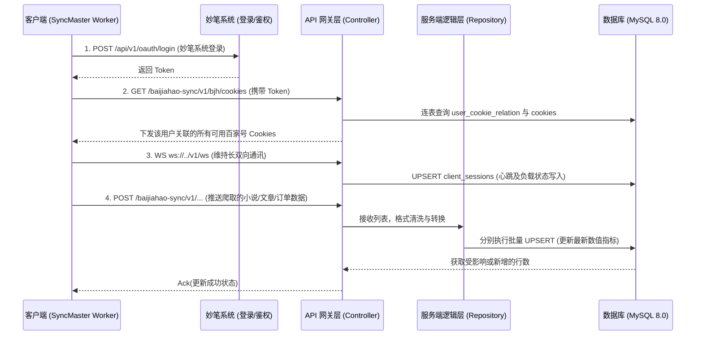

# 百家号小说数据同步 (BaijiahaoSync) 接口规范文档

基于妙笔系统现有账号体系进行鉴权，本模块只负责百家号 Cookie 管理与小说/文章/订单数据的同步上报。

---

## 0. 数据整体交互流程图



---

## 1. 鉴权说明

### 1.1 账号体系

复用妙笔系统现有的用户体系（`users` 表），客户端通过妙笔系统的登录接口获取 Token。

| 项目 | 说明 |
|------|------|
| 登录接口 | `POST /api/v1/oauth/login`（妙笔系统已有） |
| 用户信息 | `GET /api/v1/user/info`（妙笔系统已有） |
| 鉴权中间件 | `userAuth`（妙笔系统 `UserAuthMiddleware`） |

### 1.2 Token 传递

所有百家号同步接口均需在请求头携带妙笔系统颁发的 Token，中间件将用户 ID 注入到 `X-User-Id` 请求头中供 Controller 使用。

---

## 2. HTTP 接口规范 (API Specification)

**生产环境 Base URL**: `https://api.miaobi-ai.com/baijiahao-sync/v1`
**开发环境 Base URL**: `https://api.miaobi-ai.tech/baijiahao-sync/v1`
**数据交互格式**: `application/json`
**鉴权方式**: 所有接口均通过 `userAuth` 中间件校验

### 2.1 获取百家号 Cookie 授权列表
* **Endpoint**: `GET /baijiahao-sync/v1/cookie/userCookies`
* **说明**: 拉取分配给该用户的有效百家号身份池。
* **业务 CRUD 流程**:
  1. **Read**: Server 凭借 `user_id` 去 `novel_baidu_subscription_user_cookie_relation` 查找所有匹配的 `cookie_id`。
  2. **Read**: 关联查询（JOIN） `novel_baidu_subscription_cookies` 获取具体的 `cookie_str`, `bjh_id`, `bjh_name` 等。过滤掉 `status = 0` 的失效凭证。
* **Response**:
```json
{
	"message": "success",
	"code": 10000,
	"refresh": 19998,
	"data": {
		"pagination": {
			"currentPage": 1,
			"from": 1,
			"lastPage": 1,
			"perPage": 10,
			"to": 1,
			"total": 1
		},
		"data": [
			{
				"id": 1,
				"cookie_str":"cookie_str",
				"bjh_avatar": "https://pic.rmb.bdstatic.com/bjh/portrait/0ad7498d79f49a878bb8fdfac68f783c.jpeg",
				"bjh_name": "星旅手稿",
				"bjh_id": "1834327105488618",
				"status": 1,
				"created_at": "2026-04-07 11:18:58",
				"updated_at": "2026-04-07 11:30:57"
			}
		]
	}
}
```

### 2.2 小说原文同步接口
* **Endpoint**: `POST /baijiahao-sync/v1/sync/novels`
* **Request**:
```json
{
	"novel_id":"123",
	"title":"标题1",
	"content":"内容1"
}
```
* **Response**:
```json
{
	"message": "success",
	"code": 10000,
	"refresh": 19998,
	"data": {
		"row": true
	}
}
```

### 2.3 小说附加数据上报接口
* **Endpoint**: `POST /baijiahao-sync/v1/sync/novelsExtras`
* **Request**:
```json
[
  {
    "nid": "10411910296742202754",
    "article_id": "180290928187891234",
    "title": "章节名称 或 引流爆点长标题",
    "url": "https://baijiahao.baidu.../...",
    "vertical_cover": "https://pic....",
    "status": "publish",
    "type": "news",
    "is_published": 1,
    "is_pay_subscribe": 1,
    "read_amount": 834,
    "like_amount": 54,
    "comment_amount": 2,
    "profit": 0.00,
    "publish_time": "2026-04-02 10:00:00"
  }
]

```
* **Response**:
```json
{
  "code": 200,
  "msg": "success",
  "data": {
    "total_received": 1,
    "success_count": 1,
    "failed_ids": []
  }
}
```

### 2.4 小说订单与宏观跑单业绩上报接口
* **Endpoint**: `POST /baijiahao-sync/v1/sync/novelOrders`
* **Request**:
```json
[
  {
    "nid": "10411910296742202754",
    "title": "霸道修仙长传合集",
    "status": "publish",
    "order_amount": 10774,
    "read_amount": 654252,
    "rec_count": 95646,
    "comment_amount": 120,
    "like_amount": 1608,
    "collection_amount": 2511,
    "share_amount": 470,
    "is_hot": 1,
    "is_pay_subscribe": 1
  }
]
```
* **Response**:
```json
{
  "code": 200,
  "msg": "success",
  "data": {
    "total_received": 1,
    "success_count": 1,
    "failed_ids": []
  }
}
```
---

## 3. WebSocket 交互规范 (WebSocket APIs)

**生产环境客户端长连入口**: `wss://api.miaobi-ai.com/v1/ws?token=TOKEN&client_id=MAC_ID`
**开发环境客户端长连入口**: `wss://api.miaobi-ai.tech/v1/ws?token=TOKEN&client_id=MAC_ID`

### 3.1 WS 交互规范（基础框架结构）
* **报文结构**: 客户端与控制中心之间采用格式化 JSON 实现双向推送。
* **基础格式**:
```json
{
  "action": "ACTION_TYPE",
  "timestamp": 1711958400,
  "msg_id": "uuid-string-for-ack",
  "payload": {}
}
```

### 3.2 心跳维护
* **方向**: `Client -> Server`
* **Action**: `HEARTBEAT`
* **逻辑说明**: 客户端每 30 秒发送，维持长连接路由映射。
* **Request Payload**: `{}`
* **Server Response (Ack)**: `{"action": "HEARTBEAT_ACK", "timestamp": 1711958410}`

### 3.3 账号在线状态与设备负载上报
* **方向**: `Client -> Server`
* **Action**: `REPORT_ONLINE_STATUS`
* **业务 CRUD 流程**:
  * Server 端收到消息后，以 `client_id` 为键 `UPDATE` 更新 `novel_baidu_subscription_client_sessions` 中对应设备的 `cpu_usage`, `mem_usage_mb`, `running_tasks`, `last_sync_time` 和心跳发生位 `last_heartbeat`。
* **Payload**:
```json
{
  "is_cookie_valid": 1,
  "running_tasks": 3,
  "cpu_usage": 15.2,
  "mem_usage_mb": 128,
  "last_sync_time": "2026-04-02 10:30:00"
}
```

### 3.4 Cookie 主动更新与推送干预
* **方向**: `Server -> Client`
* **Action**: `UPDATE_BJH_COOKIE`
* **业务 CRUD 流程**:
  * 管理员在后台操作时，写入库后向长连接推送命令强制客户端加载新 Cookie。
* **Payload**:
```json
{
  "cookie": "BDUSS=xxxx; BAIDUID=yyyy; ...",
  "version": "20260402001",
  "force_restart_worker": true
}
```

### 3.5 账号状态控制（即刻强制阻断下线）
* **方向**: `Server -> Client`
* **Action**: `ACCOUNT_DISABLE`
* **业务 CRUD 流程**:
  * 中央后台禁用了某用户时触发，即时通过网关踢出用户。
* **Payload**:
```json
{
  "reason": "账户在其他设备登录 / 试用期结束 / 危险异常中止",
  "code": 4001
}
```
